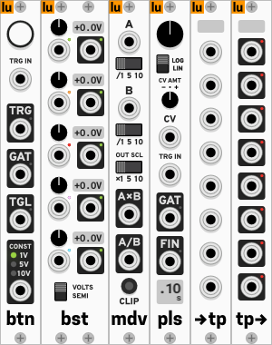
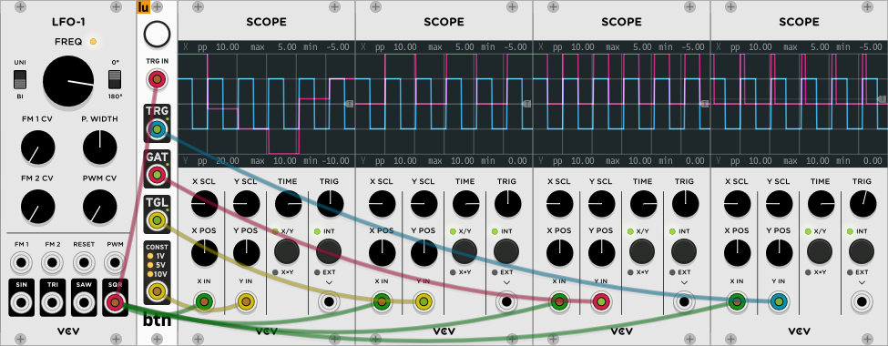
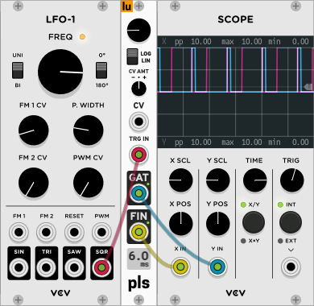
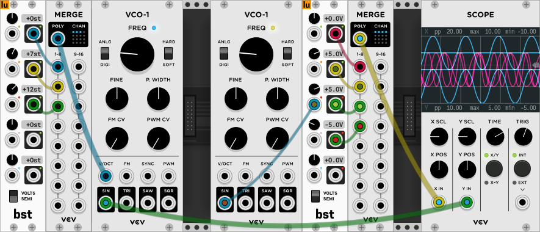
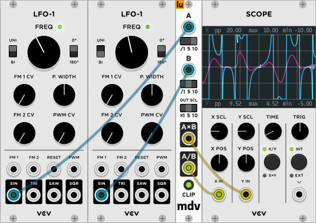
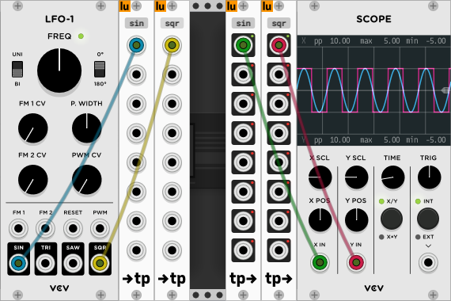

# Little Utils

Little Utils is a small collection of minimalistic [VCV
Rack](https://vcvrack.com/) modules, with a focus on usefulness and simplicity
instead of faithful analog emulation. Here's all of them:

Most of these modules were born out of me yelling "How the hell is this not in
Fundamental?!". Much of the functionality is available in other plugin packs,
but I didn't want to download 30 modules just to add two numbers together. Oh
and I also tried to make them look nice.

All modules except for Button have polyphonic support.

## Button
This module has a button. When you press it, TRG outputs a 1ms 10V trigger, GAT
outputs 10V while the button is being held and TGL toggles between 0V and 10V on
each button press.

There was some space left at the bottom so I added a constant voltage source for
good measure. You can toggle the voltage by pressing the button. Sending a gate
signal to the trigger input TRG IN is the same as pressing the button.

## Pulse Generator
Generate simple gate pulses with a given duration by sending a trigger to TRG
IN. Use the big knob to control the base pulse duration and the small knob to
adjust the CV amount. The pulse duration or CV amount are shown on the bottom
display. The output of GAT is high while the pulse is on, and FIN outputs a
trigger when the pulse finishes.

You can chain several of these together by wiring the FIN output to the TRG IN
of another Pulse Generator. This way, you can create interesting drum patterns,
or even make a really clunky PWM oscillator by creating a loop!  When the
trigger is polyphonic, the output will be polyphonic with one gate signal for
each trigger. Note, however, that the gate duration is the same for all of them.

## Bias/Semitone
The Bias/Semitone module can offset incoming signals, or it can act as a
constant voltage source. Use the button at the bottom to switch between whether
the offset is in volts or semitones. It can be used to create e.g. chords.

If an output is disconnected but an input above it is connected, the input
signal is propagated downwards, much like with 8Vert from Fundamental. The LED
color of an output indicates which input it is receiving.

## Multiply/Divide
This is a module that does some simple maths, as the name suggests. Use the
switches to scale an input in e.g. the range -5..5V to the range -1..1, so that
the output is sensible. There's also a button clip the output to +/-10V, just in
case.

If A is disconnected, A×B will output 1×B and A/B will output 1/B. If B is
disconnected, both A×B and A/B will output A.

## Teleport In/Out
Create wireless links between a pair of inputs/outputs. Click on the label of an
input and type any 4-letter case-sensitive label, and click on the label of an
output to select a valid label from the list of available inputs.

The LEDs indicate which inputs are active on the other end. Multiple outputs can
read signals from a single input, but each input must have an unique label.
Note that if you have multithreading enabled, you _might_ run into audio
glitches since there's no thread synchronization between the inputs and outputs,
but I haven't come across this myself.

## Contributing
If you have suggestions or feedback or find a bug or whatever, feel free to open
an issue or a pull request in this repository!

Building the modules follows the [standard procedure](https://vcvrack.com/manual/PluginDevelopmentTutorial.html#creating-the-template-plugin):
`RACK_DIR=/path/to/Rack_SDK/ make install`.
