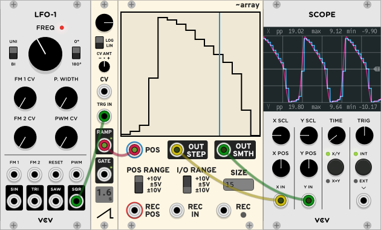
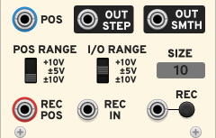
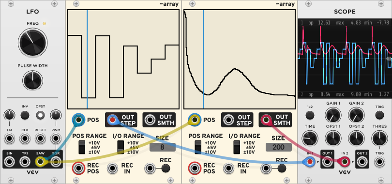
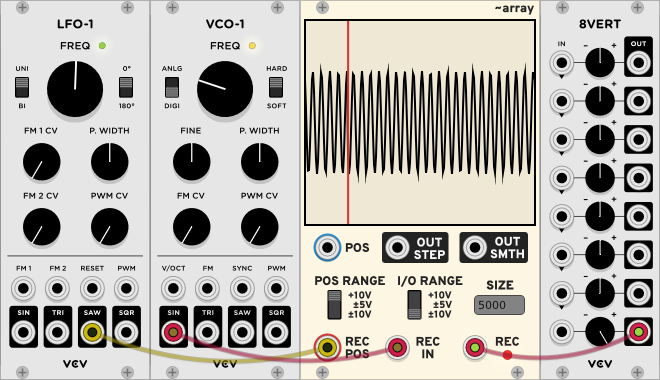
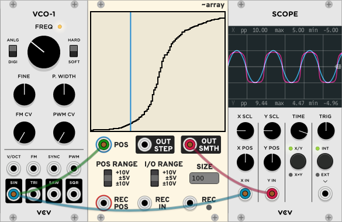
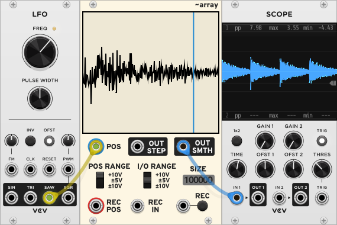
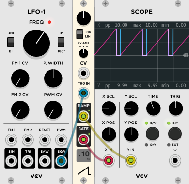
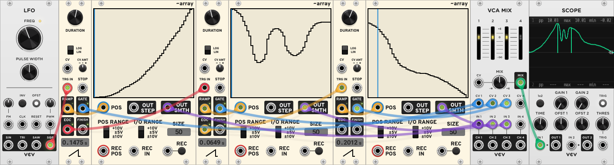
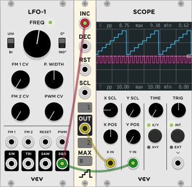

# PdArray

PdArray is a plugin for the [VCV Rack](https://vcvrack.com/) virtual modular
synthesizer that allows creating custom envelopes, much like the `array` object
in [Pure Data](https://puredata.info/). You can enter values into the array
either by manually drawing, recording an input, or loading a sample. A CV input
controls the position of a cursor for reading out the array values. There are
two outputs: one will output the stepped values of the array directly (useful
for e.g. sequencing), and the other will output smooth interpolated values,
using the same interpolation algorithm as the `tabread4~` object in Pd.



PdArray can be used as an envelope generator, sequencer, sample player,
waveshaper or in a number of other weird and interesting ways.

The plugin also contains two small companion modules called Miniramp and
Ministep. Miniramp can be used to to easily record or read out the array
sequentially, while Ministep helps with stepping through the array using a
clock, like a traditional sequencer.


## Array
Array is the main module of the PdArray plugin. This is its interface:



On the top row, you will find one input and two outputs. The POS input takes a
CV (or audio) signal which determines which value from the array to read, or
play back. The value at this position will then be output to OUT STEP and OUT
SMTH. The OUT STEP output contains the array values directly, while OUT SMTH
will output smoothed (interpolated) values.

The POS input supports polyphony. When a polyphonic cable is inserted into POS,
each voltage in the input will have its own cursor, and the OUT STEP and OUT
SMTH outputs will output polyphonic signals at each of the cursors.

The POS RANGE switch can be used to select the expected range of the POS input;
use +10V for e.g. unipolar LFO's and Miniramp, +-5V for bipolar LFO's and audio
signals. Similarly, the I/O RANGE switch selects the range of values that you
wish to record and what the outputs will have. Setting the switch to +10V means
that the top edge of the visual representation of the array corresponds to +10V
and the bottom edge to 0V, while for +-5 and +-10 the top and bottom edges of
the array are plus and minus 5 or 10 volts, respectively, and the middle
corresponds to 0V.

The SIZE screen displays the current number of elements in the array. You can
click on the screen to type a value up to 999999. If the array has more
elements than there are pixels on the display, drawing will affect multiple
array values at once.

By default, the array values are saved along with the patch file. If the array
has less than 5000 elements, the array data is serialized directly as a JSON
array. Otherwise, the array is saved as a wav file in the patch storage folder.
To reduce disk space, it is also possible to save only the path to a loaded wav
file, or to not save the array data at all, in which case only the array SIZE
is saved in the patch. This behavior can be changed from the "Data persistence"
right-click menu.

The bottom row contains CV inputs related to recording. The REC POS dictates
the position in the array where a recorded value will be written. Its expected
values are set using POS RANGE, just as for the playback POS. Input the signal
or values you want to record to the REC IN input, and click and hold the REC
LED or send a gate voltage to the REC input to record. Only monophonic
recording is supported.

Right-clicking on the module will open up some additional options, like
initializing or sorting the array, loading an audio file and setting the
interpolation mode.

If the Array module is bypassed, the signal that is being sent to REC IN is
directly output to both OUT STEP and OUT SMTH.

### Drawing sequences or envelopes



The most basic usage of PdArray is to just draw a sequence of values or an
envelope with your mouse. Increase the SIZE to get a smoother array, although
you can get reasonably smooth envelopes even with a small SIZE if you use the
OUT SMTH output.

### Recording



Input a ramp or LFO signal to REC POS, send audio or CV (or anything really) to
REC IN, send a high gate to the REC input or click on the LED, and watch how
the input signal gets imprinted to the array in real time.

By right-clicking on the module, you can switch between gate and toggle modes
for recording. In gate mode, the input is recorded while the REC input is high
(or you hold down the LED), while in toggle mode, recording is toggled on or
off by a trigger to the REC input or when clicking the LED, as the name
suggests.

### Using PdArray as a waveshaper



PdArray can be easily used as a waveshaper by either drawing or recording a
waveshaper curve, and then sending an audio signal to the POS CV input, with a
POS RANGE of +-5V for typical audio signals. You can even re-record the curve
while the audio is playing for interesting effects!

### Loading and playing samples



By right-clicking on the Array module, you can load a wav sample file. You can
choose to keep the current SIZE of the array when loading the file, or you can
automatically resize the array to the number of samples in the wav file, up to
the maximum of 999999 samples. In the non-resizing version, the number in the
right-click menu shows the duration of the loaded sample at the current sample
rate. After selecting a file, the array will contain the first N samples of the
audio file, where N is the array size shown in the SIZE display. If N is larger
than the number of samples in the wav file, the rest of the array will be left
unchanged.

The audio file will always be loaded from the beginning, so you will need to
trim your file with an external audio editing application if you wish to load
it starting from another position.

Playing back a sample works the same way as reading the array in general: input
a voltage to POS and connect the outputs to wherever.

After loading a sample, drawing will be automatically locked to prevent
accidentally modifying the sample, but it can be unlocked from the right-click
menu.

If you want to automatically load the audio file the next time you open the
patch, you can set "Data persistence" to "Save path to loaded sample".


#### Preventing clicks in sample playback

The Array module gives you a lot of freedom in the way you can play back
samples, but this comes with some downsides. If the sample you are using
doesn't start or end at a [zero crossing](https://en.wikipedia.org/wiki/Zero_crossing),
you may hear a click during playback.

There are a couple of ways to deal with this. A simple trick is to click the
Array REC button once with the REC POS and REC IN ports disconnected. This way,
the first sample in the array will be set to zero. A slightly better method is
to use the "Add fade in/out to prevent clicks" option in the right-click menu
of Array, which creates short fades at the array start and end (the length is
indicated in the right-click menu as a number of samples, or data points, in
the array). This should work well for most samples, but note that if you're not
using the "save full array data to patch" setting, this will not be saved the
next time you open the patch. Lastly, if you're playing back the samples using
Miniramp (see below), you can also try changing the "ramp value when finished"
setting from the right-click menu.


## Miniramp



Miniramp is a small envelope generator that outputs a linear ramp from 0 to 10V
in a given time. The duration of the ramp is shown on a display at the bottom.
The large knob controls the base duration, either with linear or logarithmic
scaling as selected by the LIN/LOG switch. You can also control the ramp
duration / speed with the CV input and CV amount knob.

When you send a trigger to TRG IN, the RAMP output will output the ramp and the
GATE output will output 10V while the ramp is in progress (useful for e.g. the
REC input of Array). The EOC output outputs a pulse when the ramp ends, and the
FINISH output indicates whether the ramp is finished: it outputs 0V when GATE
outputs 10V and 10V when GATE outputs 0V. You can interrupt (i.e. reset) the
ramp by sending a pulse to the STOP input.

If the CV modulation or TRIG IN input of Miniramp is polyphonic, all of the
outputs will be polyphonic, with individual ramp, gate, EOC, and finish
indicators for each channel. If any of the CV, TRG IN or STOP inputs are
monophonic, they affect all channels; if they are polyphonic, they affect each
channel individually. For example, if you have a polyphonic signal going to the
CV input (with the CV AMT knob set to a nonzero value), and you send a
monophonic trigger to TRIG IN, you can simultaneously trigger multiple ramps
with different lengths.

You can right-click on Miniramp to change its behavior. By default, the ramp
output value is 0V when the ramp output is finished, but with the "ramp value
when finished" option set to 10V, the output value will remain at 10V. This can
prevent clicks if you're using Miniramp to play back samples from an Array. If
the "Send EOC on STOP" option is enabled, Miniramp will output a trigger from
the EOC port even if the ramp is interrupted by a trigger input to the STOP
port. If the "Update duration only on trigger" option is enabled, the duration
knob and CV modulation will only affect the ramp duration when Miniramp
receives a trigger from the TRG IN input. By default, the ramp duration is
updated continuously. Enabling this option is equivalent to having a sample and
hold on the ramp duration. With this option enabled, the display shows the ramp
duration that was in effect when the last trigger was received.

### Chaining Arrays using Miniramp

Using the EOC output, it is possible to chain several Arrays one after another,
for example to create an envelope with several stages, or to play samples that
exceed the maximum size of Array.



Note how in the above screenshot, the segments have different lengths because
of the different duration settings of the ramps. The CV on the VCA mixer is
modulated by the GATE outputs to mute the arrays while they are not playing. To
avoid clicks between the envelope segments, make sure that you join up the
start and end values of the segments, and set the "interpolation at boundary"
mode of the Arrays to "mirror" or "constant". Despite this, you may get some
single-sample spikes (zero values) at the segment boundaries, as you can see in
the screenshot above. These can be removed with e.g. the Process module from
VCV Fundamental with a 1-ms slew.


## Ministep



Ministep is a counter that can be used to step through an Array, like a
sequencer. The current value of the counter is shown on the middle display.
Sending a trigger to INC increments the counter, while a trigger to DEC
decrements it. The RST input resets the counter to 1. You can click on the MAX
display to change the maximum number of steps, up to 999.

The SCL CV input controls how much the counter increments/decrements on each
step. The step size is shown on the top display. When no cable is connected,
the step size is 1, but note that connecting a 0V signal sets the step size to
zero (you can also input negative values!). By default, setting SCL to 10 volts
makes the step size equal to MAX, but the behavior can be changed to make one
volt correspond to one step from the "scale mode" right-click menu. The step
size is always rounded towards zero.

By default, the output will be 10V divided into N steps, where N is the maximum
number. This way, it is easy to use with an Array whose SIZE is set equal to N.
However, from the "output mode" right-click menu, you can also configure
Ministep to output the step number directly as a voltage. In this mode, step 1
outputs 0V, step 2 outputs 1V and so on.

If any of the INC, DEC or RST inputs are polyphonic, there will be one counter
per channel. Sending a monophonic trigger to the reset input resets all
channels, while a polyphonic trigger can be used to reset individual channels.
Similarly, a monophonic CV connected to SCL scales the step size of all
channels, while a polyphonic signal affects each channel separately.

By detecting the falling edge of the output or applying a threshold to the
output value near zero, you can use Ministep as a clock divider! Fiddling with
SCL can also lead to interesting results. A step size that has few divisors can
be used to generate somewhat random voltages, or triggering the increment at
audio rate and adjusting the step size can create interesting harmonics.


## Contributing
If you have suggestions or feedback or find a bug or whatever, feel free to open
an issue or a pull request in this repository!

Building the modules follows the [standard procedure](https://vcvrack.com/manual/PluginDevelopmentTutorial.html):
```
export RACK_DIR=/path/to/Rack_SDK/
make install
```


## Licenses
The source code and panel artwork are copyright 2023 Márton Gunyhó. Licensed
under the EUPL (see [LICENSE](LICENSE.txt)). This repo also contains the fonts
used for creating the panels: Overpass is licensed under the Open Font License
(see [here](res/fonts/OFL.txt)) and Roboto is licensed under the Apache 2
License (see [here](res/fonts/APACHE2.txt)).
